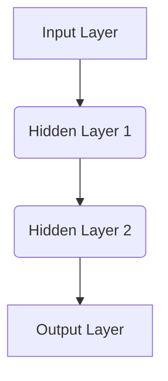

# Trabalho Computacional 3. Rede Convolucional e Transfer Learning

> [!IMPORTANT]
> **Nome**: *Gabriel Martins Silveira de Oliveira*.  
> **Matrícula**: 190042656.

---

```mermaid
graph TD;
    A-->B;
    A-->C;
    B-->D;
    C-->D;
```

```mermaid
graph TD
    A[Input Layer] --> B(Hidden Layer 1);
    B --> C(Hidden Layer 2);
    C --> D[Output Layer];
```