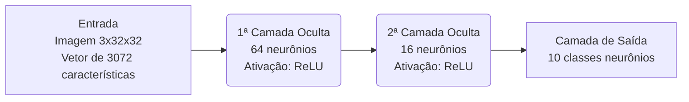
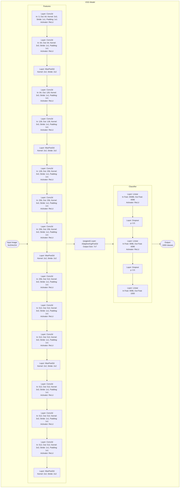
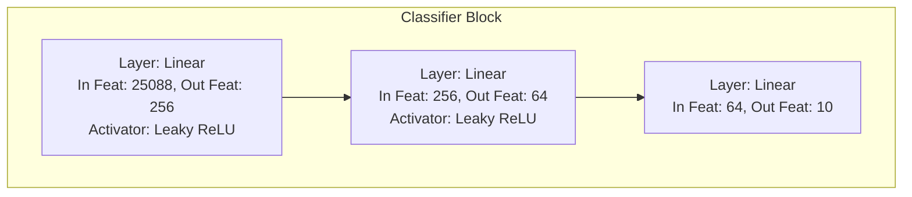

# Trabalho Computacional 3. Rede Convolucional e Transfer Learning

> [!IMPORTANT]
> **Nome**: *Gabriel Martins Silveira de Oliveira*.  
> **Matrícula**: 190042656.

## Instruções

Este trabalho pode ser executado localmente; no entanto, recomendo que o faça no Google Colab,
utilizando a GPU que eles disponibilizam, com 16 GB de VRAM.  
O *tamanho do batch* (`batch_size`), o *pin memory* (`pin_memory`) e outros hiperparâmetros foram 
otimizados para serem executados nos servidores do Google, dada a infraestrutura disponível.

Considere reduzir o *tamanho do batch* (batch size) caso o execute localmente, 
dependendo da quantidade de memória que possuir. 
O *pin memory* também pode causar erros caso haja insuficiência de memória.

## Estruturas Utilizadas no Trabalho

Neste trabalho, foram utilizados três modelos distintos: o primeiro consiste em uma MLP (Multi-Layer Perceptron) com duas camadas ocultas; o segundo é o modelo VGG16, cuja camada classificadora final foi modificada para ser uma MLP de duas camadas; e, por último, o modelo InceptionV3 da Google, onde sua última camada linear foi substituída por uma MLP.

Abaixo, será apresentada a demonstração gráfica de cada estrutura, utilizando `Mermaid`. Infelizmente, não foi possível renderizar as estruturas diretamente no *notebook*; contudo, o GitHub deverá ser capaz de exibi-las.

## MLP 

<center>


</center>

# VGG16



### Alterações feitas:



## InceptionV3 da Google

```mermaid
graph TD
    subgraph Inception3_Model [InceptionV3 Model]
        %%direction TD

        Input([Input Image:<br/>3 channels])

        subgraph Stem_Block [Stem Layers]
            %%direction TD
            bc1a["Conv2d_1a_3x3:<br/>Conv(3, 32, k=3, s=2) + BN + ReLU"]
            bc2a["Conv2d_2a_3x3:<br/>Conv(32, 32, k=3, s=1) + BN + ReLU"]
            bc2b["Conv2d_2b_3x3:<br/>Conv(32, 64, k=3, s=1, p=1) + BN + ReLU"]
            mp1["maxpool1:<br/>MaxPool2d(k=3, s=2, p=0)"]
            bc3b["Conv2d_3b_1x1:<br/>Conv(64, 80, k=1, s=1) + BN + ReLU"]
            bc4a["Conv2d_4a_3x3:<br/>Conv(80, 192, k=3, s=1) + BN + ReLU"]
            mp2["maxpool2:<br/>MaxPool2d(k=3, s=2, p=0)"]

            bc1a --> bc2a --> bc2b --> mp1 --> bc3b --> bc4a --> mp2
        end

        subgraph Mixed_5b_Block ["Mixed_5b (InceptionA) Out: 256"]
            direction LR
            in_5b("Input(192)")

            subgraph Branch1x1_5b [Branch 1x1]
                bc1x1_5b["branch1x1:<br/>Conv(192, 64, k=1) + BN + ReLU"]
            end

            subgraph Branch5x5_5b [Branch 5x5]
                b5x5_1_5b["branch5x5_1:<br/>Conv(192, 48, k=1) + BN + ReLU"]
                b5x5_2_5b["branch5x5_2:<br/>Conv(48, 64, k=5, p=2) + BN + ReLU"]
                b5x5_1_5b --> b5x5_2_5b
            end

            subgraph Branch3x3dbl_5b [Branch 3x3 Dbl]
                b3x3dbl_1_5b["branch3x3dbl_1:<br/>Conv(192, 64, k=1) + BN + ReLU"]
                b3x3dbl_2_5b["branch3x3dbl_2:<br/>Conv(64, 96, k=3, p=1) + BN + ReLU"]
                b3x3dbl_3_5b["branch3x3dbl_3:<br/>Conv(96, 96, k=3, p=1) + BN + ReLU"]
                b3x3dbl_1_5b --> b3x3dbl_2_5b --> b3x3dbl_3_5b
            end

            subgraph BranchPool_5b [Branch Pool]
                mpool_5b("AvgPool2d(k=3, s=1, p=1)")
                bp_5b["branch_pool:<br/>Conv(192, 32, k=1) + BN + ReLU"]
                mpool_5b --> bp_5b
            end

            in_5b --"Input"--> Branch1x1_5b
            in_5b --"Input"--> Branch5x5_5b
            in_5b --"Input"--> Branch3x3dbl_5b
            in_5b --"Input"--> BranchPool_5b

            bc1x1_5b & b5x5_2_5b & b3x3dbl_3_5b & bp_5b --> Concat_5b((Concatenate:<br/>256 channels))
        end

        subgraph Mixed_5c_Block ["Mixed_5c (InceptionA) Out: 288"]
            direction LR
            in_5c("Input(256)")
            subgraph Branch1x1_5c
                bc1x1_5c["branch1x1:<br/>Conv(256, 64, k=1) + BN + ReLU"]
            end
            subgraph Branch5x5_5c
                b5x5_1_5c["branch5x5_1:<br/>Conv(256, 48, k=1) + BN + ReLU"]
                b5x5_2_5c["branch5x5_2:<br/>Conv(48, 64, k=5, p=2) + BN + ReLU"]
                b5x5_1_5c --> b5x5_2_5c
            end
            subgraph Branch3x3dbl_5c
                b3x3dbl_1_5c["branch3x3dbl_1:<br/>Conv(256, 64, k=1) + BN + ReLU"]
                b3x3dbl_2_5c["branch3x3dbl_2:<br/>Conv(64, 96, k=3, p=1) + BN + ReLU"]
                b3x3dbl_3_5c["branch3x3dbl_3:<br/>Conv(96, 96, k=3, p=1) + BN + ReLU"]
                b3x3dbl_1_5c --> b3x3dbl_2_5c --> b3x3dbl_3_5c
            end
            subgraph BranchPool_5c
                mpool_5c("AvgPool2d(k=3, s=1, p=1)")
                bp_5c["branch_pool:<br/>Conv(256, 64, k=1) + BN + ReLU"]
                mpool_5c --> bp_5c
            end
            in_5c --"Input"--> Branch1x1_5c
            in_5c --"Input"--> Branch5x5_5c
            in_5c --"Input"--> Branch3x3dbl_5c
            in_5c --"Input"--> BranchPool_5c
            bc1x1_5c & b5x5_2_5c & b3x3dbl_3_5c & bp_5c --> Concat_5c((Concatenate:<br/>288 channels))
        end

        subgraph Mixed_5d_Block ["Mixed_5d (InceptionA) Out: 288"]
            direction LR
            in_5d("Input(288)")
            subgraph Branch1x1_5d
                bc1x1_5d["branch1x1:<br/>Conv(288, 64, k=1) + BN + ReLU"]
            end
            subgraph Branch5x5_5d
                b5x5_1_5d["branch5x5_1:<br/>Conv(288, 48, k=1) + BN + ReLU"]
                b5x5_2_5d["branch5x5_2:<br/>Conv(48, 64, k=5, p=2) + BN + ReLU"]
                b5x5_1_5d --> b5x5_2_5d
            end
            subgraph Branch3x3dbl_5d
                b3x3dbl_1_5d["branch3x3dbl_1:<br/>Conv(288, 64, k=1) + BN + ReLU"]
                b3x3dbl_2_5d["branch3x3dbl_2:<br/>Conv(64, 96, k=3, p=1) + BN + ReLU"]
                b3x3dbl_3_5d["branch3x3dbl_3:<br/>Conv(96, 96, k=3, p=1) + BN + ReLU"]
                b3x3dbl_1_5d --> b3x3dbl_2_5d --> b3x3dbl_3_5d
            end
            subgraph BranchPool_5d
                mpool_5d("AvgPool2d(k=3, s=1, p=1)")
                bp_5d["branch_pool:<br/>Conv(288, 64, k=1) + BN + ReLU"]
                mpool_5d --> bp_5d
            end
            in_5d --"Input"--> Branch1x1_5d
            in_5d --"Input"--> Branch5x5_5d
            in_5d --"Input"--> Branch3x3dbl_5d
            in_5d --"Input"--> BranchPool_5d
            bc1x1_5d & b5x5_2_5d & b3x3dbl_3_5d & bp_5d --> Concat_5d((Concatenate:<br/>288 channels))
        end

        subgraph Mixed_6a_Block ["Mixed_6a (InceptionB) Out: 768"]
            direction LR
            in_6a("Input(288)")

            subgraph Branch3x3_6a [Branch 3x3]
                b3x3_6a["branch3x3:<br/>Conv(288, 384, k=3, s=2) + BN + ReLU"]
            end

            subgraph Branch3x3dbl_6a [Branch 3x3 Dbl]
                b3x3dbl_1_6a["branch3x3dbl_1:<br/>Conv(288, 64, k=1) + BN + ReLU"]
                b3x3dbl_2_6a["branch3x3dbl_2:<br/>Conv(64, 96, k=3, p=1) + BN + ReLU"]
                b3x3dbl_3_6a["branch3x3dbl_3:<br/>Conv(96, 96, k=3, s=2) + BN + ReLU"]
                b3x3dbl_1_6a --> b3x3dbl_2_6a --> b3x3dbl_3_6a
            end

            subgraph MaxPool_6a [Max Pool]
                mpool_6a("MaxPool2d(k=3, s=2, p=0)")
            end

            in_6a --"Input"--> Branch3x3_6a
            in_6a --"Input"--> Branch3x3dbl_6a
            in_6a --"Input"--> MaxPool_6a

            b3x3_6a & b3x3dbl_3_6a & mpool_6a --> Concat_6a((Concatenate:<br/>768 channels))
        end

        subgraph Mixed_6b_Block ["Mixed_6b (InceptionC) Out: 768"]
            direction LR
            in_6b("Input(768)")

            subgraph Branch1x1_6b [Branch 1x1]
                bc1x1_6b["branch1x1:<br/>Conv(768, 192, k=1) + BN + ReLU"]
            end

            subgraph Branch7x7_6b [Branch 7x7]
                b7x7_1_6b["branch7x7_1:<br/>Conv(768, 128, k=1) + BN + ReLU"]
                b7x7_2_6b["branch7x7_2:<br/>Conv(128, 128, k=1x7, p=0,3) + BN + ReLU"]
                b7x7_3_6b["branch7x7_3:<br/>Conv(128, 192, k=7x1, p=3,0) + BN + ReLU"]
                b7x7_1_6b --> b7x7_2_6b --> b7x7_3_6b
            end

            subgraph Branch7x7dbl_6b [Branch 7x7 Dbl]
                b7x7dbl_1_6b["branch7x7dbl_1:<br/>Conv(768, 128, k=1) + BN + ReLU"]
                b7x7dbl_2_6b["branch7x7dbl_2:<br/>Conv(128, 128, k=7x1, p=3,0) + BN + ReLU"]
                b7x7dbl_3_6b["branch7x7dbl_3:<br/>Conv(128, 128, k=1x7, p=0,3) + BN + ReLU"]
                b7x7dbl_4_6b["branch7x7dbl_4:<br/>Conv(128, 128, k=7x1, p=3,0) + BN + ReLU"]
                b7x7dbl_5_6b["branch7x7dbl_5:<br/>Conv(128, 192, k=1x7, p=0,3) + BN + ReLU"]
                b7x7dbl_1_6b --> b7x7dbl_2_6b --> b7x7dbl_3_6b --> b7x7dbl_4_6b --> b7x7dbl_5_6b
            end

            subgraph BranchPool_6b [Branch Pool]
                mpool_6b("AvgPool2d(k=3, s=1, p=1)")
                bp_6b["branch_pool:<br/>Conv(768, 192, k=1) + BN + ReLU"]
                mpool_6b --> bp_6b
            end

            in_6b --"Input"--> Branch1x1_6b
            in_6b --"Input"--> Branch7x7_6b
            in_6b --"Input"--> Branch7x7dbl_6b
            in_6b --"Input"--> BranchPool_6b

            bc1x1_6b & b7x7_3_6b & b7x7dbl_5_6b & bp_6b --> Concat_6b((Concatenate:<br/>768 channels))
        end

        subgraph Mixed_6c_Block ["Mixed_6c (InceptionC) Out: 768"]
            direction LR
            in_6c("Input(768)")
            subgraph Branch1x1_6c
                bc1x1_6c["branch1x1:<br/>Conv(768, 192, k=1) + BN + ReLU"]
            end
            subgraph Branch7x7_6c
                b7x7_1_6c["branch7x7_1:<br/>Conv(768, 160, k=1) + BN + ReLU"]
                b7x7_2_6c["branch7x7_2:<br/>Conv(160, 160, k=1x7, p=0,3) + BN + ReLU"]
                b7x7_3_6c["branch7x7_3:<br/>Conv(160, 192, k=7x1, p=3,0) + BN + ReLU"]
                b7x7_1_6c --> b7x7_2_6c --> b7x7_3_6c
            end
            subgraph Branch7x7dbl_6c
                b7x7dbl_1_6c["branch7x7dbl_1:<br/>Conv(768, 160, k=1) + BN + ReLU"]
                b7x7dbl_2_6c["branch7x7dbl_2:<br/>Conv(160, 160, k=7x1, p=3,0) + BN + ReLU"]
                b7x7dbl_3_6c["branch7x7dbl_3:<br/>Conv(160, 160, k=1x7, p=0,3) + BN + ReLU"]
                b7x7dbl_4_6c["branch7x7dbl_4:<br/>Conv(160, 160, k=7x1, p=3,0) + BN + ReLU"]
                b7x7dbl_5_6c["branch7x7dbl_5:<br/>Conv(160, 192, k=1x7, p=0,3) + BN + ReLU"]
                b7x7dbl_1_6c --> b7x7dbl_2_6c --> b7x7dbl_3_6c --> b7x7dbl_4_6c --> b7x7dbl_5_6c
            end
            subgraph BranchPool_6c
                mpool_6c("AvgPool2d(k=3, s=1, p=1)")
                bp_6c["branch_pool:<br/>Conv(768, 192, k=1) + BN + ReLU"]
                mpool_6c --> bp_6c
            end
            in_6c --"Input"--> Branch1x1_6c
            in_6c --"Input"--> Branch7x7_6c
            in_6c --"Input"--> Branch7x7dbl_6c
            in_6c --"Input"--> BranchPool_6c
            bc1x1_6c & b7x7_3_6c & b7x7dbl_5_6c & bp_6c --> Concat_6c((Concatenate:<br/>768 channels))
        end

        subgraph Mixed_6d_Block ["Mixed_6d (InceptionC) Out: 768"]
            direction LR
            in_6d("Input(768)")
            subgraph Branch1x1_6d
                bc1x1_6d["branch1x1:<br/>Conv(768, 192, k=1) + BN + ReLU"]
            end
            subgraph Branch7x7_6d
                b7x7_1_6d["branch7x7_1:<br/>Conv(768, 160, k=1) + BN + ReLU"]
                b7x7_2_6d["branch7x7_2:<br/>Conv(160, 160, k=1x7, p=0,3) + BN + ReLU"]
                b7x7_3_6d["branch7x7_3:<br/>Conv(160, 192, k=7x1, p=3,0) + BN + ReLU"]
                b7x7_1_6d --> b7x7_2_6d --> b7x7_3_6d
            end
            subgraph Branch7x7dbl_6d
                b7x7dbl_1_6d["branch7x7dbl_1:<br/>Conv(768, 160, k=1) + BN + ReLU"]
                b7x7dbl_2_6d["branch7x7dbl_2:<br/>Conv(160, 160, k=7x1, p=3,0) + BN + ReLU"]
                b7x7dbl_3_6d["branch7x7dbl_3:<br/>Conv(160, 160, k=1x7, p=0,3) + BN + ReLU"]
                b7x7dbl_4_6d["branch7x7dbl_4:<br/>Conv(160, 160, k=7x1, p=3,0) + BN + ReLU"]
                b7x7dbl_5_6d["branch7x7dbl_5:<br/>Conv(160, 192, k=1x7, p=0,3) + BN + ReLU"]
                b7x7dbl_1_6d --> b7x7dbl_2_6d --> b7x7dbl_3_6d --> b7x7dbl_4_6d --> b7x7dbl_5_6d
            end
            subgraph BranchPool_6d
                mpool_6d("AvgPool2d(k=3, s=1, p=1)")
                bp_6d["branch_pool:<br/>Conv(768, 192, k=1) + BN + ReLU"]
                mpool_6d --> bp_6d
            end
            in_6d --"Input"--> Branch1x1_6d
            in_6d --"Input"--> Branch7x7_6d
            in_6d --"Input"--> Branch7x7dbl_6d
            in_6d --"Input"--> BranchPool_6d
            bc1x1_6d & b7x7_3_6d & b7x7dbl_5_6d & bp_6d --> Concat_6d((Concatenate:<br/>768 channels))
        end

        subgraph Mixed_6e_Block ["Mixed_6e (InceptionC) Out: 768"]
            direction LR
            in_6e("Input(768)")
            subgraph Branch1x1_6e
                bc1x1_6e["branch1x1:<br/>Conv(768, 192, k=1) + BN + ReLU"]
            end
            subgraph Branch7x7_6e
                b7x7_1_6e["branch7x7_1:<br/>Conv(768, 192, k=1) + BN + ReLU"]
                b7x7_2_6e["branch7x7_2:<br/>Conv(192, 192, k=1x7, p=0,3) + BN + ReLU"]
                b7x7_3_6e["branch7x7_3:<br/>Conv(192, 192, k=7x1, p=3,0) + BN + ReLU"]
                b7x7_1_6e --> b7x7_2_6e --> b7x7_3_6e
            end
            subgraph Branch7x7dbl_6e
                b7x7dbl_1_6e["branch7x7dbl_1:<br/>Conv(768, 192, k=1) + BN + ReLU"]
                b7x7dbl_2_6e["branch7x7dbl_2:<br/>Conv(192, 192, k=7x1, p=3,0) + BN + ReLU"]
                b7x7dbl_3_6e["branch7x7dbl_3:<br/>Conv(192, 192, k=1x7, p=0,3) + BN + ReLU"]
                b7x7dbl_4_6e["branch7x7dbl_4:<br/>Conv(192, 192, k=7x1, p=3,0) + BN + ReLU"]
                b7x7dbl_5_6e["branch7x7dbl_5:<br/>Conv(192, 192, k=1x7, p=0,3) + BN + ReLU"]
                b7x7dbl_1_6e --> b7x7dbl_2_6e --> b7x7dbl_3_6e --> b7x7dbl_4_6e --> b7x7dbl_5_6e
            end
            subgraph BranchPool_6e
                mpool_6e("AvgPool2d(k=3, s=1, p=1)")
                bp_6e["branch_pool:<br/>Conv(768, 192, k=1) + BN + ReLU"]
                mpool_6e --> bp_6e
            end
            in_6e --"Input"--> Branch1x1_6e
            in_6e --"Input"--> Branch7x7_6e
            in_6e --"Input"--> Branch7x7dbl_6e
            in_6e --"Input"--> BranchPool_6e
            bc1x1_6e & b7x7_3_6e & b7x7dbl_5_6e & bp_6e --> Concat_6e((Concatenate:<br/>768 channels))
        end

        subgraph AuxLogits_Block [AuxLogits Classifier]
            %%direction TD
            in_aux("Input(768 from Mixed_6e)")
            aux_avgpool_5x5["Aux AvgPool:<br/>AdaptiveAvgPool2d(Out: (5,5))"]
            aux_conv0["conv0:<br/>Conv(768, 128, k=1) + BN + ReLU"]
            aux_conv1["conv1:<br/>Conv(128, 768, k=5) + BN + ReLU"]
            aux_avgpool_1x1["Aux AvgPool:<br/>AdaptiveAvgPool2d(Out: (1,1))"]
            aux_flatten["Flatten"]
            aux_fc["fc:<br/>Linear(768, 1000)"]
            in_aux --> aux_avgpool_5x5 --> aux_conv0 --> aux_conv1 --> aux_avgpool_1x1 --> aux_flatten --> aux_fc
        end

        subgraph Mixed_7a_Block ["Mixed_7a (InceptionD) Out: 1280"]
            direction LR
            in_7a("Input(768)")

            subgraph Branch3x3_7a [Branch 3x3]
                b3x3_1_7a["branch3x3_1:<br/>Conv(768, 192, k=1) + BN + ReLU"]
                b3x3_2_7a["branch3x3_2:<br/>Conv(192, 320, k=3, s=2) + BN + ReLU"]
                b3x3_1_7a --> b3x3_2_7a
            end

            subgraph Branch7x7x3_7a [Branch 7x7x3]
                b7x7x3_1_7a["branch7x7x3_1:<br/>Conv(768, 192, k=1) + BN + ReLU"]
                b7x7x3_2_7a["branch7x7x3_2:<br/>Conv(192, 192, k=1x7, p=0,3) + BN + ReLU"]
                b7x7x3_3_7a["branch7x7x3_3:<br/>Conv(192, 192, k=7x1, p=3,0) + BN + ReLU"]
                b7x7x3_4_7a["branch7x7x3_4:<br/>Conv(192, 192, k=3, s=2) + BN + ReLU"]
                b7x7x3_1_7a --> b7x7x3_2_7a --> b7x7x3_3_7a --> b7x7x3_4_7a
            end

            subgraph MaxPool_7a [Max Pool]
                mpool_7a("MaxPool2d(k=3, s=2, p=0)")
            end

            in_7a --"Input"--> Branch3x3_7a
            in_7a --"Input"--> Branch7x7x3_7a
            in_7a --"Input"--> MaxPool_7a

            b3x3_2_7a & b7x7x3_4_7a & mpool_7a --> Concat_7a((Concatenate:<br/>1280 channels))
        end

        subgraph Mixed_7b_Block ["Mixed_7b (InceptionE) Out: 2048"]
            direction LR
            in_7b("Input(1280)")

            subgraph Branch1x1_7b [Branch 1x1]
                bc1x1_7b["branch1x1:<br/>Conv(1280, 320, k=1) + BN + ReLU"]
            end

            subgraph Branch3x3_7b [Branch 3x3]
                b3x3_1_7b["branch3x3_1:<br/>Conv(1280, 384, k=1) + BN + ReLU"]
                split_3x3_7b{{"Split"}}
                b3x3_2a_7b["branch3x3_2a:<br/>Conv(384, 384, k=1x3, p=0,1) + BN + ReLU"]
                b3x3_2b_7b["branch3x3_2b:<br/>Conv(384, 384, k=3x1, p=1,0) + BN + ReLU"]
                b3x3_1_7b --> split_3x3_7b
                split_3x3_7b --"H-Split"--> b3x3_2a_7b
                split_3x3_7b --"V-Split"--> b3x3_2b_7b
                b3x3_2a_7b & b3x3_2b_7b --> Concat_3x3_7b((Concat: 768))
            end

            subgraph Branch3x3dbl_7b [Branch 3x3 Dbl]
                b3x3dbl_1_7b["branch3x3dbl_1:<br/>Conv(1280, 448, k=1) + BN + ReLU"]
                b3x3dbl_2_7b["branch3x3dbl_2:<br/>Conv(448, 384, k=3, p=1) + BN + ReLU"]
                split_3x3dbl_7b{{"Split"}}
                b3x3dbl_3a_7b["branch3x3dbl_3a:<br/>Conv(384, 384, k=1x3, p=0,1) + BN + ReLU"]
                b3x3dbl_3b_7b["branch3x3dbl_3b:<br/>Conv(384, 384, k=3x1, p=1,0) + BN + ReLU"]
                b3x3dbl_1_7b --> b3x3dbl_2_7b --> split_3x3dbl_7b
                split_3x3dbl_7b --"H-Split"--> b3x3dbl_3a_7b
                split_3x3dbl_7b --"V-Split"--> b3x3dbl_3b_7b
                b3x3dbl_3a_7b & b3x3dbl_3b_7b --> Concat_3x3dbl_7b((Concat: 768))
            end

            subgraph BranchPool_7b [Branch Pool]
                mpool_7b("AvgPool2d(k=3, s=1, p=1)")
                bp_7b["branch_pool:<br/>Conv(1280, 192, k=1) + BN + ReLU"]
                mpool_7b --> bp_7b
            end

            in_7b --"Input"--> Branch1x1_7b
            in_7b --"Input"--> Branch3x3_7b
            in_7b --"Input"--> Branch3x3dbl_7b
            in_7b --"Input"--> BranchPool_7b

            bc1x1_7b & Concat_3x3_7b & Concat_3x3dbl_7b & bp_7b --> Concat_7b((Concatenate:<br/>2048 channels))
        end

        subgraph Mixed_7c_Block ["Mixed_7c (InceptionE) Out: 2048"]
            direction LR
            in_7c("Input(2048)")
            subgraph Branch1x1_7c
                bc1x1_7c["branch1x1:<br/>Conv(2048, 320, k=1) + BN + ReLU"]
            end
            subgraph Branch3x3_7c
                b3x3_1_7c["branch3x3_1:<br/>Conv(2048, 384, k=1) + BN + ReLU"]
                split_3x3_7c{{"Split"}}
                b3x3_2a_7c["branch3x3_2a:<br/>Conv(384, 384, k=1x3, p=0,1) + BN + ReLU"]
                b3x3_2b_7c["branch3x3_2b:<br/>Conv(384, 384, k=3x1, p=1,0) + BN + ReLU"]
                b3x3_1_7c --> split_3x3_7c
                split_3x3_7c --"H-Split"--> b3x3_2a_7c
                split_3x3_7c --"V-Split"--> b3x3_2b_7c
                b3x3_2a_7c & b3x3_2b_7c --> Concat_3x3_7c((Concat: 768))
            end
            subgraph Branch3x3dbl_7c
                b3x3dbl_1_7c["branch3x3dbl_1:<br/>Conv(2048, 448, k=1) + BN + ReLU"]
                b3x3dbl_2_7c["branch3x3dbl_2:<br/>Conv(448, 384, k=3, p=1) + BN + ReLU"]
                split_3x3dbl_7c{{"Split"}}
                b3x3dbl_3a_7c["branch3x3dbl_3a:<br/>Conv(384, 384, k=1x3, p=0,1) + BN + ReLU"]
                b3x3dbl_3b_7c["branch3x3dbl_3b:<br/>Conv(384, 384, k=3x1, p=1,0) + BN + ReLU"]
                b3x3dbl_1_7c --> b3x3dbl_2_7c --> split_3x3dbl_7c
                split_3x3dbl_7c --"H-Split"--> b3x3dbl_3a_7c
                split_3x3dbl_7c --"V-Split"--> b3x3dbl_3b_7c
                b3x3dbl_3a_7c & b3x3dbl_3b_7c --> Concat_3x3dbl_7c((Concat: 768))
            end
            subgraph BranchPool_7c
                mpool_7c("AvgPool2d(k=3, s=1, p=1)")
                bp_7c["branch_pool:<br/>Conv(2048, 192, k=1) + BN + ReLU"]
                mpool_7c --> bp_7c
            end
            in_7c --"Input"--> Branch1x1_7c
            in_7c --"Input"--> Branch3x3_7c
            in_7c --"Input"--> Branch3x3dbl_7c
            in_7c --"Input"--> BranchPool_7c
            bc1x1_7c & Concat_3x3_7c & Concat_3x3dbl_7c & bp_7c --> Concat_7c((Concatenate:<br/>2048 channels))
        end

        subgraph Final_Layers [Classifier Head]
            avgpool["avgpool:<br/>AdaptiveAvgPool2d(Out: (1,1))"]
            dropout["dropout:<br/>Dropout(p=0.5)"]
            fc["fc:<br/>Linear(2048, 1000)"]
            avgpool --> dropout --> fc
        end

        Input --> Stem_Block
        Stem_Block --> Mixed_5b_Block
        Mixed_5b_Block --> Mixed_5c_Block
        Mixed_5c_Block --> Mixed_5d_Block
        Mixed_5d_Block --> Mixed_6a_Block
        Mixed_6a_Block --> Mixed_6b_Block
        Mixed_6b_Block --> Mixed_6c_Block
        Mixed_6c_Block --> Mixed_6d_Block
        Mixed_6d_Block --> Mixed_6e_Block

        Mixed_6e_Block --"Main path"--> Mixed_7a_Block
        Mixed_6e_Block --"Auxiliary path"--> AuxLogits_Block

        Mixed_7a_Block --> Mixed_7b_Block
        Mixed_7b_Block --> Mixed_7c_Block
        Mixed_7c_Block --> Final_Layers
        Final_Layers --> Output
    end
```
